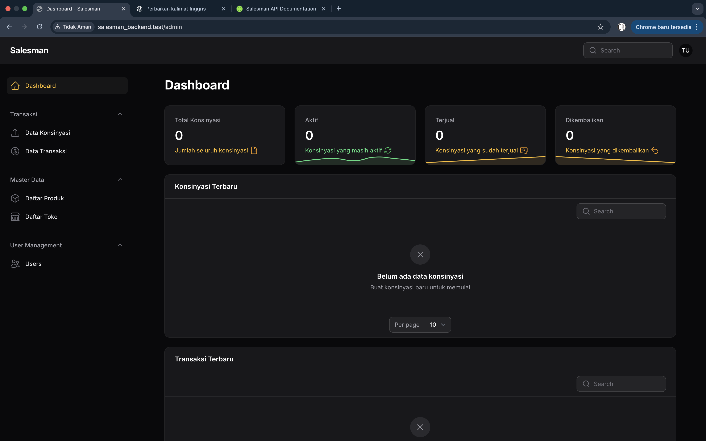

# Salesman Backend




## 📚 API Documentation

You can access the API documentation after running the project at:

```
http://localhost:8000/api/documentation
```

## 📋 Tentang Aplikasi

Aplikasi Salesman adalah sebuah sistem manajemen penjualan yang dibangun dengan Laravel. Aplikasi ini dirancang untuk membantu tim penjualan dalam mengelola data pelanggan, transaksi, dan laporan penjualan.

## Fitur Utama

- Manajemen Data Salesman
- Manajemen Pelanggan
- Pencatatan Transaksi Penjualan
- Laporan Penjualan
- Autentikasi dan Otorisasi
- Dashboard Interaktif

## Persyaratan Sistem

- PHP 8.1 atau lebih baru
- Composer
- MySQL 5.7+ atau MariaDB 10.3+
- Node.js & NPM

## Instalasi

1. Clone repository ini:
   ```bash
   git clone [url-repository]
   cd salesman_backend
   ```

2. Install dependensi PHP:
   ```bash
   composer install
   ```

3. Install dependensi frontend:
   ```bash
   npm install
   npm run build
   ```

4. Salin file .env.example ke .env:
   ```bash
   cp .env.example .env
   ```

5. Generate application key:
   ```bash
   php artisan key:generate
   ```

6. Konfigurasi database di file .env:
   ```env
   DB_CONNECTION=mysql
   DB_HOST=127.0.0.1
   DB_PORT=3306
   DB_DATABASE=salesman
   DB_USERNAME=root
   DB_PASSWORD=
   ```

7. Jalankan migrasi database:
   ```bash
   php artisan migrate --seed
   ```

8. Jalankan server development:
   ```bash
   php artisan serve
   ```

   Aplikasi akan berjalan di http://localhost:8000

## Penggunaan

1. Akses aplikasi di browser
2. Login menggunakan kredensial yang telah dibuat
3. Mulai menggunakan aplikasi untuk mengelola data penjualan

## Kontribusi

1. Fork repository ini
2. Buat branch untuk fitur baru (`git checkout -b fitur-baru`)
3. Commit perubahan (`git commit -m 'Menambahkan fitur baru'`)
4. Push ke branch (`git push origin fitur-baru`)
5. Buat Pull Request

## Lisensi

Aplikasi ini bersifat open-source di bawah lisensi [MIT](https://opensource.org/licenses/MIT).
